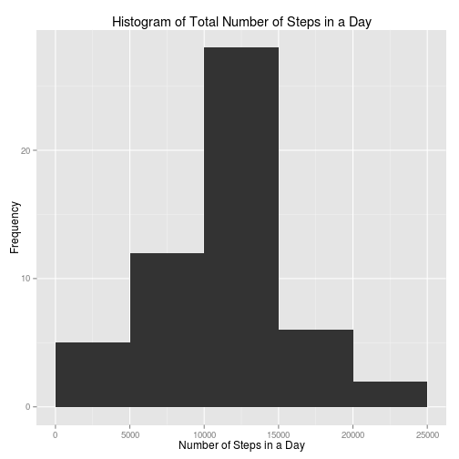
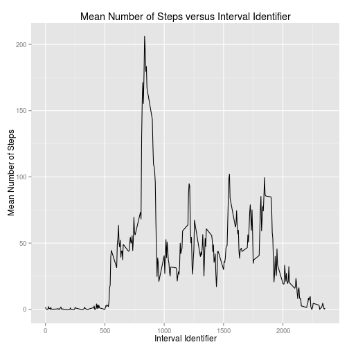
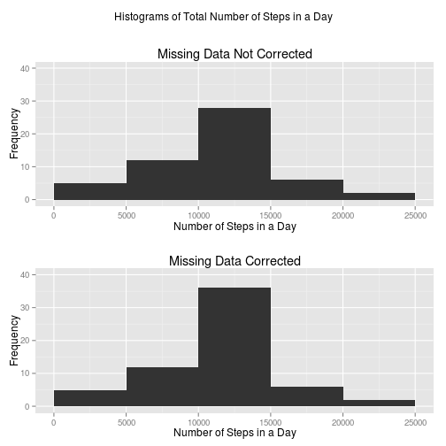
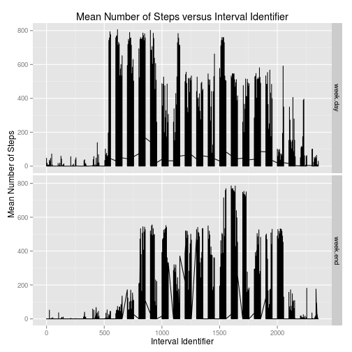

---
output:
  pdf_document: default
  html_document:
    keep_md: yes
---
# Reproducible Research: Peer Assessment 1
NOTE: Set working directory to directory containing this file.

Load required libraries

```r
library(ggplot2)
library(data.table)
```

```
## data.table 1.9.2  For help type: help("data.table")
```

```r
library(grid)
library(gridExtra)
```

## Loading and preprocessing the data
The data is loaded to a 'data table', directly from the zipped file:

```r
step.data <- data.table(read.csv(unz("activity.zip", "activity.csv")))
setkey(step.data, date, interval)
```
A quick check of the data is performed as follows:

```r
head(step.data)
```

```
##    steps       date interval
## 1:    NA 2012-10-01        0
## 2:    NA 2012-10-01        5
## 3:    NA 2012-10-01       10
## 4:    NA 2012-10-01       15
## 5:    NA 2012-10-01       20
## 6:    NA 2012-10-01       25
```

```r
dim(step.data)
```

```
## [1] 17568     3
```
This is consistent with expectations.

## What is mean total number of steps taken per day?
Data tables can easily be aggregated by key values.  Above, I set 'date' to be a key and then calculated the sum aggregated by this key.  From this, the ggplot library is used to plot a histogram.  Then, the mean and median total number of steps are calculated and reported.

```r
# aggregate total steps per day
sum.steps.per.day <- step.data[, list(sumSteps = sum(steps)), by = date]

# plot histogram of total steps per day
g1 <- ggplot(sum.steps.per.day, aes(x = sumSteps))
g1 <- g1 + geom_histogram(binwidth = 5000)
g1 <- g1 + xlab("Number of Steps in a Day")
g1 <- g1 + ylab("Frequency")
g1 <- g1 + ggtitle("Histogram of Total Number of Steps in a Day")
g1 <- g1 + xlim(0, 25000)
print(g1)
```

 

```r
ggsave("Figure1.png", g1, path = "figures", width = 10, height = 10)

# write out results
cat(sprintf("Mean Number of Total Steps per Day: %.1f", 
                        sum.steps.per.day[, mean(sumSteps, na.rm = T)]))
```

```
## Mean Number of Total Steps per Day: 10766.2
```

```r
cat(sprintf("Median Number of Total Steps per Day: %.1f", 
                        sum.steps.per.day[, median(sumSteps, na.rm = T)]))
```

```
## Median Number of Total Steps per Day: 10765.0
```

## What is the average daily activity pattern?
Using a similar approach to above, the data table aggregate mean is computed by interval.  

```r
# aggregate mean steps by interval
ave.steps.per.int <- 
        step.data[, list(aveSteps = mean(steps, na.rm = T)), by = interval]

# plot time series
g2 <- ggplot(ave.steps.per.int, aes(y = aveSteps, x = interval))
g2 <- g2 + geom_line()
g2 <- g2 + xlab("Interval Identifier")
g2 <- g2 + ylab("Mean Number of Steps")
g2 <- g2 + ggtitle("Mean Number of Steps versus Interval Identifier")
print(g2)
```

 

```r
ggsave("Figure2.png", g2, path = "figures", width = 10, height = 10)

# write out results
cat(sprintf(
        "The inteval with the maximum number of steps, on average, is: %i", 
        ave.steps.per.int[, interval[which.max(aveSteps)]]))
```

```
## The inteval with the maximum number of steps, on average, is: 835
```

## Inputing missing values
The number of missing data is computed as follows:

```r
cat(sprintf(
        "The total number of missing data is: %i", 
        step.data[, sum(is.na(steps))]))
```

```
## The total number of missing data is: 2304
```

Here, I will 'correct' the missing data by substituting in the mean steps for that interval across all of the days of collected data:

```r
# correction to data
step.data[, stepsCor := 
                ifelse(
                        is.na(steps), 
                        ave.steps.per.int[interval == interval, aveSteps], 
                        steps
                )
]
```

```
##        steps       date interval stepsCor
##     1:    NA 2012-10-01        0  1.71698
##     2:    NA 2012-10-01        5  0.33962
##     3:    NA 2012-10-01       10  0.13208
##     4:    NA 2012-10-01       15  0.15094
##     5:    NA 2012-10-01       20  0.07547
##    ---                                   
## 17564:    NA 2012-11-30     2335  4.69811
## 17565:    NA 2012-11-30     2340  3.30189
## 17566:    NA 2012-11-30     2345  0.64151
## 17567:    NA 2012-11-30     2350  0.22642
## 17568:    NA 2012-11-30     2355  1.07547
```

```r
# aggregate data
sum.steps.per.day <- step.data[, 
                list(sumSteps = sum(steps), sumStepsCor = sum(stepsCor)), 
                by = date]

# plot data
g3 <- ggplot(sum.steps.per.day, aes(x = sumSteps))
g3 <- g3 + geom_histogram(binwidth = 5000)
g3 <- g3 + xlab("Number of Steps in a Day")
g3 <- g3 + ylab("Frequency")
g3 <- g3 + ggtitle("Missing Data Not Corrected")
g3 <- g3 + xlim(0, 25000) + ylim(0, 40)  

g4 <- ggplot(sum.steps.per.day, aes(x = sumStepsCor))
g4 <- g4 + geom_histogram(binwidth = 5000)
g4 <- g4 + xlab("Number of Steps in a Day")
g4 <- g4 + ylab("Frequency")
g4 <- g4 + ggtitle("Missing Data Corrected")
g4 <- g4 + xlim(0, 25000) + ylim(0, 40)

g4 <- arrangeGrob(g3, g4, ncol = 1, 
                main = "Histograms of Total Number of Steps in a Day")
print(g4)
```

 

```r
ggsave("Figure3.png", g4, path = "figures", width = 10, height = 10)

# write out results
summary(sum.steps.per.day)
```

```
##          date       sumSteps      sumStepsCor   
##  2012-10-01: 1   Min.   :   41   Min.   :   41  
##  2012-10-02: 1   1st Qu.: 8841   1st Qu.: 9819  
##  2012-10-03: 1   Median :10765   Median :10766  
##  2012-10-04: 1   Mean   :10766   Mean   :10766  
##  2012-10-05: 1   3rd Qu.:13294   3rd Qu.:12811  
##  2012-10-06: 1   Max.   :21194   Max.   :21194  
##  (Other)   :55   NA's   :8
```
As can be observed in the summary table, correcting the missing data has not had no effect on the mean and only a small effect on the median.  

## Are there differences in activity patterns between weekdays and weekends?
The following code identifies whether days are weekday or weekends.  Subsequently, a  plot is generated for the mean number of steps versus the interval, faceted by whether the day is during the week or at the weekend. 

```r
# create factor to identify whether day is week or weekend
step.data[, week.day := 
                        ifelse(weekdays(as.Date(date),T) %in% 
                        c("Sat", "Sun"), "week.end", "week.day")]
```

```
##        steps       date interval stepsCor week.day
##     1:    NA 2012-10-01        0  1.71698 week.day
##     2:    NA 2012-10-01        5  0.33962 week.day
##     3:    NA 2012-10-01       10  0.13208 week.day
##     4:    NA 2012-10-01       15  0.15094 week.day
##     5:    NA 2012-10-01       20  0.07547 week.day
##    ---                                            
## 17564:    NA 2012-11-30     2335  4.69811 week.day
## 17565:    NA 2012-11-30     2340  3.30189 week.day
## 17566:    NA 2012-11-30     2345  0.64151 week.day
## 17567:    NA 2012-11-30     2350  0.22642 week.day
## 17568:    NA 2012-11-30     2355  1.07547 week.day
```

```r
# aggregate data 
ave.steps.per.int <- 
                        step.data[, list(aveSteps = mean(stepsCor, na.rm = T)), 
                        by = c("interval", "week.day")]

# plot data
g5 <- ggplot(data = step.data, aes(x = interval, y = stepsCor))
g5 <- g5 + geom_line() 
g5 <- g5 + facet_grid(week.day ~.)
g5 <- g5 + xlab("Interval Identifier")
g5 <- g5 + ylab("Mean Number of Steps")
g5 <- g5 + ggtitle("Mean Number of Steps versus Interval Identifier")
print(g5)
```

 

```r
ggsave("Figure4.png", g5, path = "figures", width = 10, height = 10)
```
