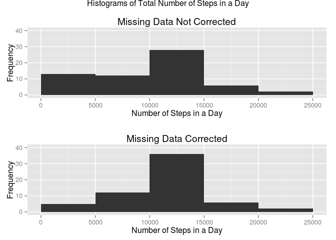

# Reproducible Research: Peer Assessment 1

Load required libraries

```r
library(ggplot2)
library(data.table)
library(grid)
library(gridExtra)
```

## Loading and preprocessing the data
In order to run this document, set working directory to directory containing this file.  The data is loaded to a 'data table', directly from the zipped file:

```r
step.data <- data.table(read.csv(unz("activity.zip", "activity.csv")))
setkey(step.data, date, interval)
```
A quick check of the data is performed as follows:

```r
head(step.data)
```

```
##    steps       date interval
## 1:    NA 2012-10-01        0
## 2:    NA 2012-10-01        5
## 3:    NA 2012-10-01       10
## 4:    NA 2012-10-01       15
## 5:    NA 2012-10-01       20
## 6:    NA 2012-10-01       25
```

```r
dim(step.data)
```

```
## [1] 17568     3
```
This is consistent with expectations.

## What is mean total number of steps taken per day?
Data tables can easily be aggregated by key values.  Above, I set 'date' to be a key and then calculated the sum aggregated by this key.  From this, the ggplot library is used to plot a histogram.  Then, the mean and median total number of steps are calculated and reported.  Note that missing values are to be ignored so I set `na.rm=T` in the code below.

```r
# aggregate total steps per day
sum.steps.per.day <- step.data[, list(sumSteps = sum(steps, na.rm = T)), by = date]

# plot histogram of total steps per day
g1 <- ggplot(sum.steps.per.day, aes(x = sumSteps))
g1 <- g1 + geom_histogram(binwidth = 5000)
g1 <- g1 + xlab("Number of Steps in a Day")
g1 <- g1 + ylab("Frequency")
g1 <- g1 + ggtitle("Histogram of Total Number of Steps in a Day")
g1 <- g1 + xlim(0, 25000)
print(g1)
```

 

```r
# write out results
cat(sprintf("Mean Number of Total Steps per Day: %.1f", 
                        sum.steps.per.day[, mean(sumSteps, na.rm = T)]))
```

```
## Mean Number of Total Steps per Day: 9354.2
```

```r
cat(sprintf("Median Number of Total Steps per Day: %.1f", 
                        sum.steps.per.day[, median(sumSteps, na.rm = T)]))
```

```
## Median Number of Total Steps per Day: 10395.0
```

## What is the average daily activity pattern?
Using a similar approach to above, the data table aggregate mean is computed by interval.  

```r
# aggregate mean steps by interval
ave.steps.per.int <- 
        step.data[, list(aveSteps = mean(steps, na.rm = T)), by = interval]

# plot time series
g2 <- ggplot(ave.steps.per.int, aes(y = aveSteps, x = interval))
g2 <- g2 + geom_line()
g2 <- g2 + xlab("Interval Identifier")
g2 <- g2 + ylab("Mean Number of Steps")
g2 <- g2 + ggtitle("Mean Number of Steps versus Interval Identifier")
print(g2)
```

 

```r
# write out results
cat(sprintf(
        "The inteval with the maximum number of steps, on average, is: %i", 
        ave.steps.per.int[, interval[which.max(aveSteps)]]))
```

```
## The inteval with the maximum number of steps, on average, is: 835
```

## Inputing missing values
The number of missing data is computed as follows:

```r
cat(sprintf(
        "The total number of missing data is: %i", 
        step.data[, sum(is.na(steps))]))
```

```
## The total number of missing data is: 2304
```

Here, I will 'correct' the missing data by substituting in the mean steps for that interval across all of the days of collected data:

```r
# correction to data
step.data[, stepsCor := 
                ifelse(
                        is.na(steps), 
                        ave.steps.per.int[interval == interval, aveSteps], 
                        steps
                )
]
```

```
##        steps       date interval stepsCor
##     1:    NA 2012-10-01        0  1.71698
##     2:    NA 2012-10-01        5  0.33962
##     3:    NA 2012-10-01       10  0.13208
##     4:    NA 2012-10-01       15  0.15094
##     5:    NA 2012-10-01       20  0.07547
##    ---                                   
## 17564:    NA 2012-11-30     2335  4.69811
## 17565:    NA 2012-11-30     2340  3.30189
## 17566:    NA 2012-11-30     2345  0.64151
## 17567:    NA 2012-11-30     2350  0.22642
## 17568:    NA 2012-11-30     2355  1.07547
```

```r
# aggregate data
sum.steps.per.day <- step.data[, 
                list(sumSteps = sum(steps, na.rm = T), sumStepsCor = sum(stepsCor)), 
                by = date]
print(sum.steps.per.day)
```

```
##           date sumSteps sumStepsCor
##  1: 2012-10-01        0       10766
##  2: 2012-10-02      126         126
##  3: 2012-10-03    11352       11352
##  4: 2012-10-04    12116       12116
##  5: 2012-10-05    13294       13294
##  6: 2012-10-06    15420       15420
##  7: 2012-10-07    11015       11015
##  8: 2012-10-08        0       10766
##  9: 2012-10-09    12811       12811
## 10: 2012-10-10     9900        9900
## 11: 2012-10-11    10304       10304
## 12: 2012-10-12    17382       17382
## 13: 2012-10-13    12426       12426
## 14: 2012-10-14    15098       15098
## 15: 2012-10-15    10139       10139
## 16: 2012-10-16    15084       15084
## 17: 2012-10-17    13452       13452
## 18: 2012-10-18    10056       10056
## 19: 2012-10-19    11829       11829
## 20: 2012-10-20    10395       10395
## 21: 2012-10-21     8821        8821
## 22: 2012-10-22    13460       13460
## 23: 2012-10-23     8918        8918
## 24: 2012-10-24     8355        8355
## 25: 2012-10-25     2492        2492
## 26: 2012-10-26     6778        6778
## 27: 2012-10-27    10119       10119
## 28: 2012-10-28    11458       11458
## 29: 2012-10-29     5018        5018
## 30: 2012-10-30     9819        9819
## 31: 2012-10-31    15414       15414
## 32: 2012-11-01        0       10766
## 33: 2012-11-02    10600       10600
## 34: 2012-11-03    10571       10571
## 35: 2012-11-04        0       10766
## 36: 2012-11-05    10439       10439
## 37: 2012-11-06     8334        8334
## 38: 2012-11-07    12883       12883
## 39: 2012-11-08     3219        3219
## 40: 2012-11-09        0       10766
## 41: 2012-11-10        0       10766
## 42: 2012-11-11    12608       12608
## 43: 2012-11-12    10765       10765
## 44: 2012-11-13     7336        7336
## 45: 2012-11-14        0       10766
## 46: 2012-11-15       41          41
## 47: 2012-11-16     5441        5441
## 48: 2012-11-17    14339       14339
## 49: 2012-11-18    15110       15110
## 50: 2012-11-19     8841        8841
## 51: 2012-11-20     4472        4472
## 52: 2012-11-21    12787       12787
## 53: 2012-11-22    20427       20427
## 54: 2012-11-23    21194       21194
## 55: 2012-11-24    14478       14478
## 56: 2012-11-25    11834       11834
## 57: 2012-11-26    11162       11162
## 58: 2012-11-27    13646       13646
## 59: 2012-11-28    10183       10183
## 60: 2012-11-29     7047        7047
## 61: 2012-11-30        0       10766
##           date sumSteps sumStepsCor
```

```r
# plot data
g3 <- ggplot(sum.steps.per.day, aes(x = sumSteps))
g3 <- g3 + geom_histogram(binwidth = 5000)
g3 <- g3 + xlab("Number of Steps in a Day")
g3 <- g3 + ylab("Frequency")
g3 <- g3 + ggtitle("Missing Data Not Corrected")
g3 <- g3 + xlim(0, 25000) + ylim(0, 40)  

g4 <- ggplot(sum.steps.per.day, aes(x = sumStepsCor))
g4 <- g4 + geom_histogram(binwidth = 5000)
g4 <- g4 + xlab("Number of Steps in a Day")
g4 <- g4 + ylab("Frequency")
g4 <- g4 + ggtitle("Missing Data Corrected")
g4 <- g4 + xlim(0, 25000) + ylim(0, 40)

g4 <- arrangeGrob(g3, g4, ncol = 1, 
                main = "Histograms of Total Number of Steps in a Day")
print(g4)
```

 

```r
# write out results
summary(sum.steps.per.day)
```

```
##          date       sumSteps      sumStepsCor   
##  2012-10-01: 1   Min.   :    0   Min.   :   41  
##  2012-10-02: 1   1st Qu.: 6778   1st Qu.: 9819  
##  2012-10-03: 1   Median :10395   Median :10766  
##  2012-10-04: 1   Mean   : 9354   Mean   :10766  
##  2012-10-05: 1   3rd Qu.:12811   3rd Qu.:12811  
##  2012-10-06: 1   Max.   :21194   Max.   :21194  
##  (Other)   :55
```
As can be observed in the summary table, correcting the missing data has increased the mean and median.  The reason is that if the missing values are simply ignored, the sums of 'missing values' will be biased towards zero.  Hence, the data is biased which is manifested as a right skewed dikstribution.  By correcting the missing data, we correct for this bias.

## Are there differences in activity patterns between weekdays and weekends?
The following code identifies whether days are weekday or weekends.  Subsequently, a  plot is generated for the mean number of steps versus the interval, faceted by whether the day is during the week or at the weekend. 

```r
# create factor to identify whether day is week or weekend
step.data[, day.type := 
                        ifelse(weekdays(as.Date(date),T) %in% 
                        c("Sat", "Sun"), "week.end.day", "week.day")]
```

```
##        steps       date interval stepsCor day.type
##     1:    NA 2012-10-01        0  1.71698 week.day
##     2:    NA 2012-10-01        5  0.33962 week.day
##     3:    NA 2012-10-01       10  0.13208 week.day
##     4:    NA 2012-10-01       15  0.15094 week.day
##     5:    NA 2012-10-01       20  0.07547 week.day
##    ---                                            
## 17564:    NA 2012-11-30     2335  4.69811 week.day
## 17565:    NA 2012-11-30     2340  3.30189 week.day
## 17566:    NA 2012-11-30     2345  0.64151 week.day
## 17567:    NA 2012-11-30     2350  0.22642 week.day
## 17568:    NA 2012-11-30     2355  1.07547 week.day
```

```r
# aggregate data 
ave.steps.per.int <- 
                        step.data[, list(aveSteps = mean(stepsCor)), 
                        by = c("interval", "day.type")]

# plot data
g5 <- ggplot(data = ave.steps.per.int, aes(x = interval, y = aveSteps))
g5 <- g5 + geom_line() 
g5 <- g5 + facet_grid(day.type ~ .)
g5 <- g5 + xlab("Interval Identifier")
g5 <- g5 + ylab("Mean Number of Steps")
g5 <- g5 + ggtitle("Mean Number of Steps versus Interval Identifier")
print(g5)
```

 
